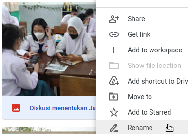
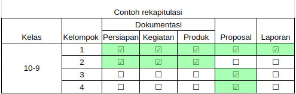

## List yang dikumpulkan 

Pada pelaporan projek, hal yang perlu dipersiapkan
* Wajib mengumpulkan dokumentasi per kelompok di [google drive](#update-catatan)
* Dokumentasi minimal 5 dengan nama file yang deskriptif, misal : `Kegiatan menentukan tempat pelaksanaan.jpg`

Struktur folder harus terisi seperti berikut
```
├── 10-1
│   ├── Dok_persiapan
│   │   ├──gambar1.jpg
│   │   ├──gambar2.jpg
│   │   ├── . . .
│   │   ├──gambar10.jpg
│   ├── Dok_pelaksanaan
│   ├── Dok_produk
│   ├── Proposal
│   │   ├──proposal.pdf
│   ├── dst . . .
├── 10-2
├── 10-3
├── dst . . 

```
Sehingga akan direkapitulasi dalam bentuk cheklist (update otomatisi ±15 min ) 

Link [rekapitulasi di sini](#update-catatan)
* Infografis laporan pelaksanaan
  - judul 
  - latar belakang singkat
  - proses (dokumentasi langkah-langkah, alur dsb)
  - foto produk atau hasil kegiatan
* Laporan berupa dokumen
  - format ada di [sini](https://bit.ly/formatlaporanprojek81)
  - laporan ditandatangi oleh guru pembimbing
* Power point (_optional_), persiapan presentasi pameran
* Pertanyaan hubungi [Pak Arif](https://wa.me/6282227551553), [Bu Fitria](https://wa.me/6282114214648), [Bu Byas](https://wa.me/628999787815)

### update catatan
>1. Pastikan kata pengantar tidak ada kata "Mentor" dan "aktualisasi" (kekeliruan pada contoh)
>2. Foto dokumentasi minimal 5 (lima) dengan nama deskriptif **jangan** `WA-123242.PNG`  **ubah menjadi** `Proses mengolah awal.PNG` dan sebagainya.
>3. Upload Laporan setelah final (melalui proses revisi) dan disimpan dalam format PDF
>4. Link format lembar pengesahan ada [di sini](https://docs.google.com/document/d/1Qs5YXfWuuWjVprZev7kM22-rUmaN8M2d0faKk8Ff1pA/copy)
>5. Link baru rekapitulasi ada [di sini](https://bit.ly/3VaYdsz) | link upload [google drive](https://bit.ly/driveprojek81)
>6. **Wajib mengisi** [penilaian teman](#penilaian-teman)

> ### penilaian-teman
> Setiap siswa wajib mengisi dengan **jujur** menilai teman masing-masing sesuai kelas di <br>
>1. [kelas 10-1](https://forms.gle/f7FYWBrnVoe9G8sX8)</br>
>2. [kelas 10-2](https://forms.gle/RC9JKj3rew9EX5kk6)</br>
>3. [kelas 10-3](https://forms.gle/16BY75fHGFRMfY187)</br>
>4. [kelas 10-4](https://forms.gle/5Xbf2Ht8yWVMNLkM8)</br>
>5. [kelas 10-5](https://forms.gle/G5aYeNPyDEK4pk5q9)</br>
>6. [kelas 10-6](https://forms.gle/gaQzxVXbEDA5Bope8)</br>
>7. [kelas 10-7](https://forms.gle/vfqGfJ3uNE9bqj5n9)</br>
>8. [kelas 10-8](https://forms.gle/jXq46yEq9FksjFFy9)</br>


